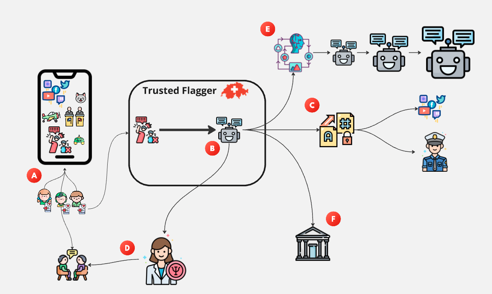
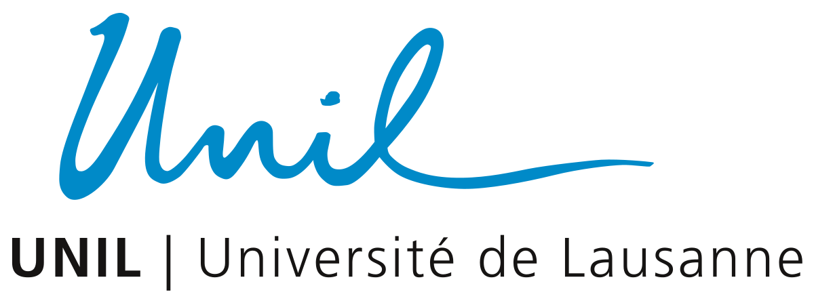
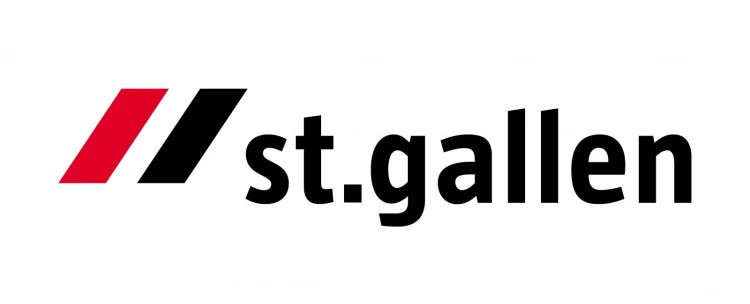
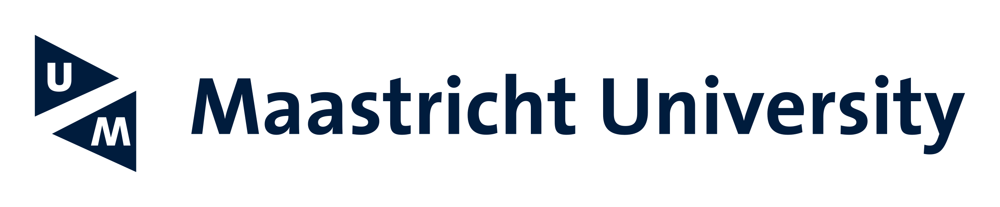
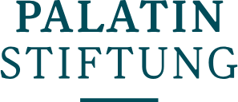

# Flag&Safe – Deine digitale Schutzstelle

*Digitale Soforthilfe bei problematischen Inhalten, Förderung der Selbstwirksamkeit von jungen Nutzer:innen, und institutionelle Vernetzung für eine sichere Online-Schweiz*

---

## 📋 Projekt-Überblick

### Das Problem: Gefahren Online
Junge Menschen stoßen immer häufiger auf problematische Inhalte wie Hassreden, Falschinformationen oder extreme Inhalte in sozialen Medien. Bestehende Schutzmaßnahmen sind oft präventiv, aber es fehlt an direkter Hilfe, wenn Kinder und Jugendliche akut mit solchen Inhalten konfrontiert werden.

### Unsere Lösung: Flag&Safe
Wir entwickeln "Flag&Safe", eine kindgerechte Plattform, auf der junge Nutzer:innen bedenkliche Online-Inhalte einfach und sicher melden können. Die Plattform prüft Meldungen automatisch vor und leitet dringende Fälle an ein Netzwerk von Fachpersonen (z.B. Schulpsycholog:innen, Beratungsstellen) weiter. So entsteht schnelle, unkomplizierte Hilfe.

<strong>Mehr zur Vision</strong>

In jüngster Zeit häufen sich Berichte über radikalisierende Inhalte in sozialen Medien – auch in der Schweiz sorgen Schlagzeilen wie „Radikalisierung im Internet: Mit TikTok zum IS-Fanatiker" für Aufmerksamkeit. Gleichzeitig berichten immer mehr junge Nutzerinnen und Nutzer, dass sie in ihren Social-Media-Feeds auf unerwünschte sexuelle, irreführende und hasserfüllte Inhalte stossen.

Mit dem Inkrafttreten des Digital Services Act in der Europäischen Union werden nun strengere Regeln für soziale Medien eingeführt, insbesondere um Kinder besser zu schützen. Ein zentraler Aspekt solcher Massnahmen sind sogenannte "Trusted Flagger". Diese Akteure identifizieren problematische Inhalte, melden sie und entfernen sie von Social-Media Plattformen.

---

## 🔄 So funktioniert Flag&Safe

<strong>Schritt A: Kinder und Jugendliche melden Inhalte</strong>

Wenn Kinder oder Jugendliche in sozialen Medien auf problematische Inhalte stoßen (z.B. extreme, radikale, hasserfüllte oder sexuelle Inhalte), können sie diese ganz einfach über unsere Plattform melden. Das geht zum Beispiel, indem sie einen Link zum Inhalt schicken oder einen Chatbot direkt in der App nutzen.

<strong>Schritt B: Inhalte werden gesammelt und geprüft</strong>

Sobald ein Inhalt gemeldet wird, sammelt unser System diesen automatisch und speichert ihn sicher ab. Spezielle Computerprogramme (künstliche Intelligenz) schauen sich den Inhalt dann genau an und prüfen, ob er gegen Regeln verstößt oder sogar illegal ist. Dabei werden auch bekannte Listen mit verbotenen Inhalten abgeglichen.

<strong>Schritt C: Automatische Meldung an Plattformen und Behörden</strong>

Wenn ein Inhalt gegen die Regeln der sozialen Medien oder gegen Gesetze verstößt, meldet unser System ihn automatisch direkt an die Betreiber der Social-Media-Plattform (z.B. TikTok, Instagram). Wenn der Inhalt ganz klar illegal ist, werden auch die zuständigen Polizeibehörden informiert.

<strong>Schritt D: Schnelle Hilfe für Betroffene</strong>

Gleichzeitig informiert das System auch lokale Hilfsstellen, wie Schulpsychologen oder Medienpädagogen. Diese Fachleute bekommen dann die wichtigsten Informationen über den gemeldeten Inhalt und können dem betroffenen Kind schnell helfen, zum Beispiel durch ein Beratungsgespräch.

<strong>Schritt E: System lernt dazu und wird besser</strong>

Alle gemeldeten Inhalte werden gesammelt und helfen dabei, unser System immer besser zu machen. Die künstliche Intelligenz lernt mit jedem neuen Fall dazu und kann so problematische Inhalte in Zukunft noch schneller und genauer erkennen. Wir können so auch besser verstehen, welche gefährlichen Trends es online gibt.

<strong>Schritt F: Infos für die Politik</strong>

Die gesammelten Informationen und Erkenntnisse geben wir auch an die Politik weiter. So können Politikerinnen und Politiker besser verstehen, welchen Gefahren Kinder und Jugendliche online ausgesetzt sind und neue Gesetze oder Regeln entwickeln, um sie besser zu schützen.

---

## 🎯 Was wir bieten

### Unsere Outputs
- ✅ **Trusted Flagger Plattform:** Eine Open-Source Softwarelösung, mit der Kinder und Jugendliche problematische Inhalte einfach melden können.
- ✅ **Workshops:** Workshops für Schulen und Beratungsstellen, um Bedürfnisse zu verstehen und den Umgang mit der Plattform zu schulen.
- ✅ **Usability-Studie:** Tests mit Kindern und Jugendlichen zur Evaluierung und Verbesserung der Plattform.
- ✅ **Wissenschaftliche Veröffentlichungen:** Publikationen zu technischen Entwicklungen und Ergebnissen.

### Zielgruppen
Unser Angebot richtet sich speziell an **Kinder und Jugendliche in der Schweiz**, die auf Social-Media-Plattformen aktiv sind.

---

## 👥 Das Projektteam

Ein interdisziplinäres Team aus Informatik, Rechtswissenschaft und Medienpädagogik:

| {:height="60px"} **Universität St.Gallen** | {:height="60px"} **Universität Lausanne** | {:height="60px"} **Primarschule Halden** | {:height="60px"} **Universität Maastricht** |
|:---:|:---:|:---:|:---:|
| Institut für Informatik | Rechtswissenschaftliche Abteilung | St.Gallen | Law&Tech Lab |
| {:height="80px" style="border-radius: 50%"} **Prof. Simon Mayer** {:height="80px" style="border-radius: 50%"} **Doktorand Luka Bekavac** | {:height="80px" style="border-radius: 50%"} **Prof. Aurelia Tamò-Larrieux** **Doktorand Alice Palmieri** | **Benjamin Lizinger** Medienpädagoge | {:height="80px" style="border-radius: 50%"} **Prof. Konrad Kollnig** (Unterstützende Funktion) |

---

## 📅 Zeitplan

**Projektstart:** 01.04.2025  
**Projektende:** 30.04.2026

### Nachhaltigkeit
Die Universität St.Gallen sichert den Betrieb der Plattform für 5 Jahre nach Projektende zu. Die Open-Source-Lösung ermöglicht zudem Weiterentwicklung und Betrieb durch Dritte.

---

## 📄 Lizenz

Dieses Projekt wird als Open-Source-Lösung entwickelt und bereitgestellt.

---

**© 2025 Flag&Safe Projekt**  

*Ein Projekt mit Unterstützung der*

{:height="120px"}

